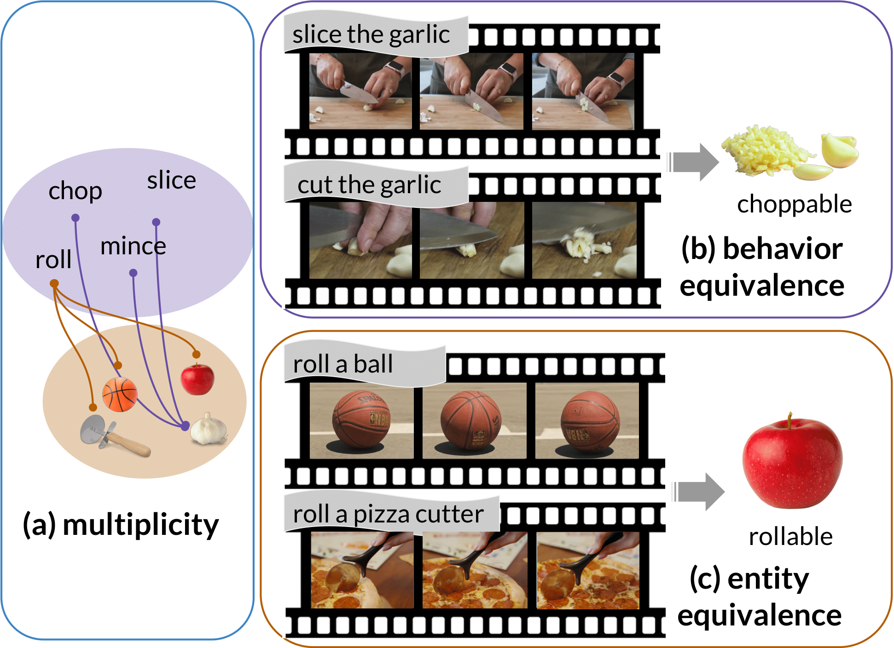

# Causal Action--Effect Modeling 
The official project repository for the IJCNLP-AACL 2023 paper: Implicit Affordance Acquisition via Causal Action–Effect Modeling in the Video Domain.\
**NOTE**: the code has not be tested.

We built upon the HERO architecture and proposed two pre-training tasks for implicit affordance learning from the video domain. \
Most codes are copied/modified from [HERO's repository](https://github.com/linjieli222/HERO). \
The visual frame feature extraction (SlowFast + ResNet-152) closely follows their recipe, which is available at [CAE_Video_Feature_Extractor](https://github.com/Mallory24/cae_video_feature_extractor).

<p align="left">
    
</p>

If you find this repository helpful, please cite:
```BibTeX
@article{yang2023affordance,
  title={Implicit Affordance Acquisition via Causal Action–Effect Modeling in the Video Domain},
  author={Yang, Hsiu-Yu and Silberer, Carina},
  journal={Proceedings of the 3rd Conference of the Asia-Pacific Chapter of the Association for Computational Linguistics and the 13th International Joint Conference on Natural Language Processing},
  year={2023}
}
```
## Create an environment
```bash
conda env create -f env.yml
```

## Quick Start
### 1. Get the pre-processed features:
To download the pre-processed input features of CAE dataset, please contact me via hsiu-yu.yang@ims.uni-stuttgart.de. \
&ast; Note: 
  * For the CAE dataset, please refer to this [repository](https://github.com/Mallory24/cae_dataset/tree/main). 
  * To reproduce the whole dataset pre-processing steps, refer to [step 5](#(Optional)-5.-to-reproduce-the-CAE-dataset-preprocessing:). 

After obtain the preprocessed features, you will see the following folder structure:
```bash
    ├── eval_table
    │   └── eval_table.json
    ├── test
    │   └── test.json
    ├── train
    │   └── train.json
    ├── val
    │   └── val.json
    ├── txt_db
    │    ├── full
    │    │   ├── data.mdb
    │    │   ├── eval_table.json
    │    │   ├── lock.mdb
    │    │   ├── meta.json
    │    │   ├── test_ids.json
    │    │   ├── train_ids.json
    │    │   ├── val_ids.json
    │    │   ├── vid2frame_sub_len.json
    │    │   ├── neg
    │    │   │    ├── train_video_based_negatives.json
    │    │   │    ├── val_10_video_based_negatives.json
    │    │   │    └── test_video_based_negatives.json
    └── video_db
        ├── full
        │    ├── id2nframe.json
        │    ├── resnet_slowfast_2.0_compressed
        │    │    ├── data.mdb
        │    │    ├── lock.mdb
        │    └── video_feat_info.pkl
```
### 2. Run pretraining:
#### MAM
```bash
export PRETRAIN_EXP=model/cae/pretrain_cae_mam
CUDA_VISIBLE_DEVICES=1,2 HOROVOD_CACHE_CAPACITY=0  horovodrun -np 2 python pretrain.py \
--config config/example-pretrain-cae-mam-random-2gpu.json \
--output_dir $PRETRAIN_EXP
```

#### MEM
```bash
export PRETRAIN_EXP=model/cae/pretrain_cae_mem
CUDA_VISIBLE_DEVICES=1,2 HOROVOD_CACHE_CAPACITY=0  horovodrun -np 2 python pretrain.py \
--config config/example-pretrain-cae-mem-random-2gpu.json \
--output_dir $PRETRAIN_EXP
```

#### MULTI-CAE (joint-task training in the round-robin fashion)
*Note: provide the checkpoints of RoBERTa-base under the field **_checkpoint_** in example_pretrain-cae-multi-2gpu.json
```bash
export PRETRAIN_EXP=model/cae/pretrain_cae_multi
CUDA_VISIBLE_DEVICES=1,2 HOROVOD_CACHE_CAPACITY=0  horovodrun -np 2 python pretrain.py \
--config config/example-pretrain-cae-multi-2gpu.json \
--output_dir $PRETRAIN_EXP
```

### 3. Run intrinsic evaluations:
*Note: replace `--output_dir` and `--checkpoint` with your own model trained in step 2.

#### Masked Action Prediction (MAP)
```bash
export PRETRAIN_EXP=pretrain_cae_mam
export PATH_TO_EXP=path_to_single_result_verb_exp
export CKPT=98500
export EXP=full
export SPLIT=test

CUDA_VISIBLE_DEVICES=0 nohup horovodrun -np 1 python eval_map.py \
--sub_txt_db $PATH_TO_EXP/txt_db/$EXP \
--vfeat_db $PATH_TO_EXP/video_db/$EXP \
--split $SPLIT \
--subset $EXP \
--task cae_video_sub \
--checkpoint $CKPT \
--model_config config/hero_finetune.json \
--batch_size 64 \
--output_dir $PRETRAIN_EXP
```
#### Masked Effect Prediction (MEP)
```bash
export PRETRAIN_EXP=pretrain_cae_mem
export PATH_TO_EXP=path_to_single_result_verb_exp
export CKPT=95000
export EXP=full
export SPLIT=test

CUDA_VISIBLE_DEVICES=0 nohup horovodrun -np 1 python eval_map.py \
--sub_txt_db $PATH_TO_EXP=/txt_db/$EXP \
--vfeat_db $PATH_TO_EXP=/video_db/$EXP \
--split $SPLIT \
--subset $EXP \
--negative_sampling_strategy video-based \
--negative_examples neg/test_video_based_negatives.json \
--task cae_video_sub \
--checkpoint $CKPT \
--model_config config/hero_finetune.json \
--batch_size 64 \
--output_dir $PRETRAIN_EXP
```

### 4. Run the extrinsic evaluation on PROST in a zero-shot manner:
*Note: replace `--output_dir` and `--checkpoint` with your own model trained in step 2.

```bash
# Take the checkpoints trained with MAM only for example:
export PRETRAIN_EXP=pretrain_cae_mam
export CKPT=98500
export DATA=path_to_prost_cache

CUDA_VISIBLE_DEVICES=0 nohup python eval_prost.py \
--checkpoint $CKPT \
--model_config config/hero_finetune.json \
--batch_size 64 \
--dataroot $DATA \
--output_dir $PRETRAIN_EXP
```


### (Optional) 5. To reproduce the CAE dataset preprocessing:
A. Create the CAE dataset from scratch: refer to this [repository](https://github.com/Mallory24/cae_dataset/blob/main/README.md). \
B. Extract visual features: refer to this [repository](https://github.com/Mallory24/cae_video_feature_extractor/blob/main/README.md). \
C. Collect visual features & save into lmdb: 
```bash
export $PATH_TO_EXP=path_to_single_result_verb_exp ($PATH_TO_CAE/single_result_verb_exp/42)
export $PATH_TO_STORAGE=path_to_videos
export $EXP_NAME=full 
```

Collect visual features:
```bash
python scripts/collect_video_feature_paths.py  \
--feature_dir $PATH_TO_STORAGE/videos/visual_features \
--output $PATH_TO_EXP/video_db/ \
--eval_table $PATH_TO_EXP/eval_table/eval_table.json  \
--dataset $EXP_NAME \
--nproc 0
```

Convert to lmdb:
```bash
python scripts/convert_videodb.py \
--vfeat_info_file $PATH_TO_EXP/video_db/$EXP_NAME/video_feat_info.pkl \
--output $PATH_TO_EXP/video_db \
--dataset $EXP_NAME \
--frame_length 2  \
--compress \
--clip_interval -1
```

After running the above codes, $PATH_TO_EXP/video_db/$EXP_NAME should have the following folder structure:
```bash
    ├── id2nframe.json
    ├── resnet_slowfast_2.0_compressed
    │    ├── data.mdb
    │    ├── lock.mdb
    └── video_feat_info.pkl
```

D. Tokenize subtitles & save into lmdb:
```bash
python scripts/prepro_sub.py \
--annotation $PATH_TO_EXP/cae.json \
--vid2nframe $PATH_TO_EXP/video_db/$EXP_NAME/id2nframe.json \
--eval_table $PATH_TO_EXP/eval_table/eval_table.json \
--frame_length 2 \
--output $PATH_TO_EXP/txt_db/$EXP_NAME
--task cae 
```
